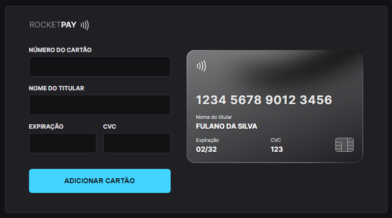
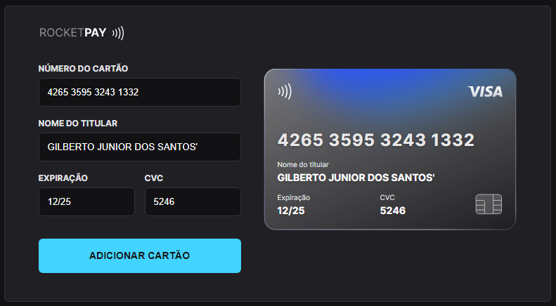
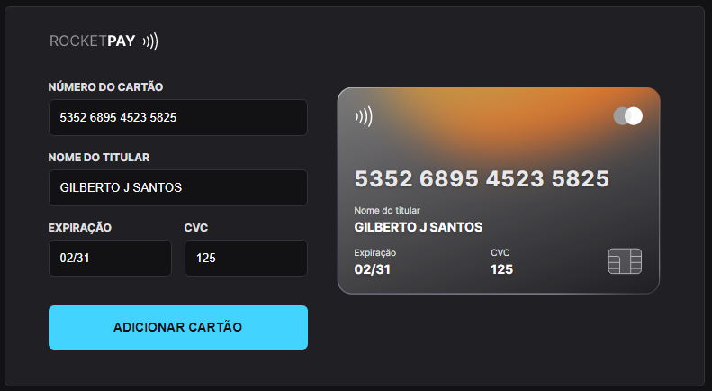

<h1 align="center"> Explorer Lab #01 </h1>

<!-- <p align="center"> -->

## 💻 Projeto

Neste Explorer Lab, aprendemos trabalhar com o DOM do HTML. É um componente que simula o formulário de preenchimento de cartão de crédito, onde é possível adicionar máscara aos inputs e atualizar elementos HTML via DOM..

Desenvolvimento feito através do javascript puro `Vanilla JS`.

Evento exclusivo e gratuito, promovido pela Rocketseat para ensino de tecnologias WEB.

<!-- </p> -->

<p align="center">
  <a href="#-tecnologias">Tecnologias</a>&nbsp;&nbsp;&nbsp;|&nbsp;&nbsp;&nbsp;
  <a href="#-projeto">Projeto</a>&nbsp;&nbsp;&nbsp;|&nbsp;&nbsp;&nbsp;
  <a href="#-layout">Layout</a>&nbsp;&nbsp;&nbsp;|&nbsp;&nbsp;&nbsp;
  <a href="#memo-licença">Licença</a>
</p>

<p align="center">
  
</p>

<br>

<p align="center">
LAYOUT CARTÃO DEFAULT
  
</p>
<p align="center">
LAYOUT CARTÃO VISA
  
</p>
<p align="center">
LAYOUT CARTÃO MASTERCARD
  
</p>

## 🚀 Tecnologias

Esse projeto foi desenvolvido com as seguintes tecnologias:

- HTML e CSS
- JavaScript e JSON
- [Node e NPM](https://nodejs.org/)
- [Vite](https://vitejs.dev/)
- [iMask](https://imask.js.org)

Usamos a dependência imask, onde usamos para fazer a mascara número do cartão de crédito, data de expiração, cvc

```
  "dependencies": {
    "imask": "^6.4.3"
  }
```

# Regex:

### Número cartão de crédito VISA: `/^4\d{0,15}/`

### Número cartão de crédito MASTERCARD: `/(^5[1-5]\d{0,2}|^22[2-9]\d|^2[3-7]\d{0,2}\d{0,12})/`

<h1 align="center">💻 Desenvolvido Por: Gilberto Júnior</h1>
